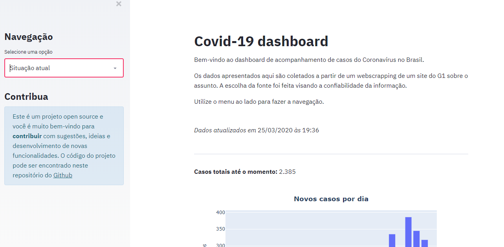
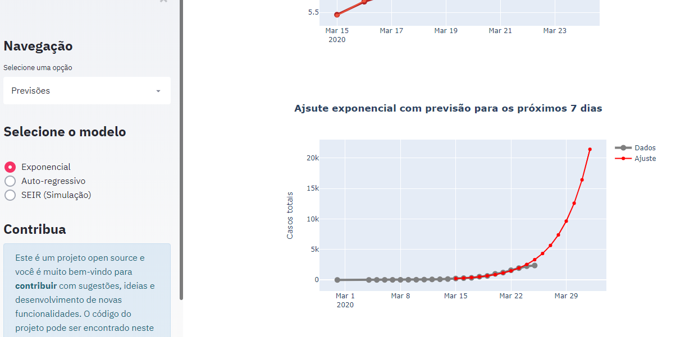

# Covid-19: Tracking number of cases in Brazil

### This is a project to build a dashboard that can track the actual scenario of covid19 in Brazil and also make some predictions into the near future.

This project is built with Streamlit for visualization and gets data by a web scrapping. Therefore, the data is actualized on a hourly basis (aproximately).




### Development Enviroment

This project utilizes Selenium and Chrome web driver, so you have to install the driver. You can find it for downloading [here](https://chromedriver.chromium.org/downloads). After donwloading, you have to set it as a variable in your PATH.

If you like, you may create a virtual env. To do that with conda, run:
```
conda create -n ENVIRONMENT_NAME python=3.7
conda activate ENVIRONMENT_NAME
```

After that, you can install the dependencies with:
```
pip install -r requirements.txt
```

### Runing the aplication

In the project folder, run:
```
streamlit run index.py
```


